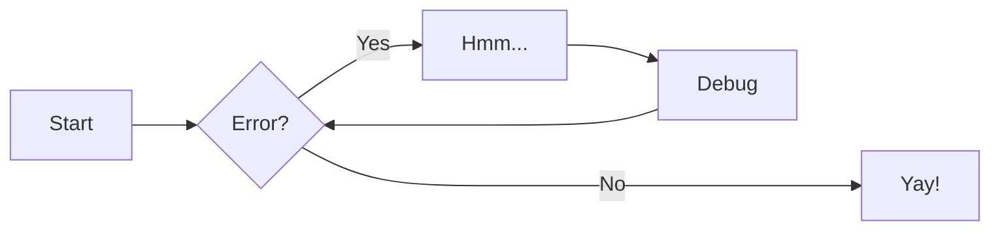

# Markdown tips

For full documentation visit [zensical.org](https://zensical.org/docs/).

## Commands

* [`zensical new`][new] - Create a new project
* [`zensical serve`][serve] - Start local web server
* [`zensical build`][build] - Build your site

  [new]: https://zensical.org/docs/usage/new/
  [serve]: https://zensical.org/docs/usage/preview/
  [build]: https://zensical.org/docs/usage/build/

## Examples

### Admonitions

> Go to [documentation](https://zensical.org/docs/authoring/admonitions/)

!!! note

    This is a **note** admonition. Use it to provide helpful information.

```
!!! note

    This is a **note** admonition. Use it to provide helpful information.
```


!!! warning

    This is a **warning** admonition. Be careful!

```
!!! warning

    This is a **warning** admonition. Be careful!
```

### Details

> Go to [documentation](https://zensical.org/docs/authoring/admonitions/#collapsible-blocks)

`> Go to [documentation](https://zensical.org/docs/authoring/admonitions/#collapsible-blocks)`

??? info "Click to expand for more info"

    This content is hidden until you click to expand it.
    Great for FAQs or long explanations.

```
??? info "Click to expand for more info"

    This content is hidden until you click to expand it.
    Great for FAQs or long explanations.
```

## Code Blocks

> Go to [documentation](https://zensical.org/docs/authoring/code-blocks/)

``` python hl_lines="2" title="Code blocks"
def greet(name):
    print(f"Hello, {name}!") # (1)!

greet("Python")
```

1.  > Go to [documentation](https://zensical.org/docs/authoring/code-blocks/#code-annotations)

    Code annotations allow to attach notes to lines of code.

Code can also be highlighted inline: `#!python print("Hello, Python!")`.

## Content tabs

> Go to [documentation](https://zensical.org/docs/authoring/content-tabs/)

=== "Python"

    ``` python
    print("Hello from Python!")
    ```

=== "Rust"

    ``` rs
    println!("Hello from Rust!");
    ```

## Diagrams

> Go to [documentation](https://zensical.org/docs/authoring/diagrams/)



## Footnotes

> Go to [documentation](https://zensical.org/docs/authoring/footnotes/)

Here's a sentence with a footnote.[^1]

Hover it, to see a tooltip.

[^1]: This is the footnote.

## Images

Use regular Markdown when you want the image to appear directly in the page:

``` md

```

You can also add hover text after the path:

``` md

```

Use a reference-style image when you want to keep the image path separate from the paragraph:

``` md
![Berry Blast smoothie][berry-blast]

[berry-blast]: ASA/images/Picture1.png "Berry Blast smoothie"
```

To size an image, use HTML instead of Markdown:

``` html

```

You can also size by percentage:

``` html

```

Use inline HTML when you want an image to sit inside a sentence:

``` html
Blend until smooth  and serve cold.
```


## Formatting

> Go to [documentation](https://zensical.org/docs/authoring/formatting/)

- ==This was marked (highlight)==
- ^^This was inserted (underline)^^
- ~~This was deleted (strikethrough)~~
- H~2~O
- A^T^A
- ++ctrl+alt+del++

## Icons, Emojis

> Go to [documentation](https://zensical.org/docs/authoring/icons-emojis/)

* :sparkles: `:sparkles:`
* :rocket: `:rocket:`
* :tada: `:tada:`
* :memo: `:memo:`
* :eyes: `:eyes:`

#### Font Awesome
To use fontawesome, you must use the `solid` folder. So the prefix is: `fontawesome-solid`

- :fontawesome-solid-mosquito-net: `:fontawesome-solid-mosquito-net:`
- :fontawesome-solid-calculator: `:fontawesome-solid-calculator:`

#### Luicide, Material Icons
- :lucide-aperture: `:lucide-aperture:`
- :material-bluetooth-connect: `:material-bluetooth-connect:`

#### Icon header:
If you want an icon to show up in the navigation page, put this at the top of your page:
```
---
icon: lucide/cpu
---
```

## Maths

> Go to [documentation](https://zensical.org/docs/authoring/math/)

$$
\cos x=\sum_{k=0}^{\infty}\frac{(-1)^k}{(2k)!}x^{2k}
$$

`\cos x=\sum_{k=0}^{\infty}\frac{(-1)^k}{(2k)!}x^{2k}`

!!! warning "Needs configuration"
    Note that MathJax is included via a `script` tag on this page and is not
    configured in the generated default configuration to avoid including it
    in a pages that do not need it. See the documentation for details on how
    to configure it on all your pages if they are more Maths-heavy than these
    simple starter pages.

<script id="MathJax-script" src="https://unpkg.com/mathjax@3/es5/tex-mml-chtml.js"></script>
<script>
  window.MathJax = {
    tex: {
      inlineMath: [["\\(", "\\)"]],
      displayMath: [["\\[", "\\]"]],
      processEscapes: true,
      processEnvironments: true
    },
    options: {
      ignoreHtmlClass: ".*|",
      processHtmlClass: "arithmatex"
    }
  };

  document$.subscribe(() => {
    MathJax.startup.output.clearCache()
    MathJax.typesetClear()
    MathJax.texReset()
    MathJax.typesetPromise()
  })
</script>

## Task Lists

> Go to [documentation](https://zensical.org/docs/authoring/lists/#using-task-lists)

I've also added a button that clears all the checks!

<div class="tasklist-clear-anchor"></div>
* [x] Install Zensical
* [x] Configure `zensical.toml`
* [x] Write amazing documentation
* [ ] Deploy anywhere

```
<div class="tasklist-clear-anchor"></div>
* [x] Install Zensical
* [x] Configure `zensical.toml`
* [x] Write amazing documentation
* [ ] Deploy anywhere
```

## Tooltips

> Go to [documentation](https://zensical.org/docs/authoring/tooltips/)

[Hover me][example]

  [example]: https://example.com "I'm a tooltip!"


---
icon: simple/markdown
---

# Markdown in 5min

## Headers

```
# H1 Header
## H2 Header
### H3 Header
#### H4 Header
##### H5 Header
###### H6 Header
```

## Text formatting

```
**bold text**
*italic text*
***bold and italic***
~~strikethrough~~
`inline code`
```

## Links and images

```
[Link text](https://example.com)
[Link with title](https://example.com "Hover title")


```

## Image examples

```
Inline image:


Reference-style image:
![Alt text][example-image]

[example-image]: images/example.png "Optional hover title"

Scaled image:


Scaled by percentage:


Small image inside a sentence:
Text before  text after.
```

## Lists

```
Unordered:

- Item 1
- Item 2
  - Nested item

Ordered:

1. First item
2. Second item
3. Third item
```

## Blockquotes

```
> This is a blockquote
> Multiple lines
>> Nested quote
```

## Code blocks

````
```javascript
function hello() {
  console.log("Hello, world!");
}
```
````

## Tables

```
| Header 1 | Header 2 | Header 3 |
|----------|----------|----------|
| Row 1    | Data     | Data     |
| Row 2    | Data     | Data     |
```

## Horizontal rule

```
---
or
***
or
___
```

## Task lists

```
- [x] Completed task
- [ ] Incomplete task
- [ ] Another task
```

## Escaping characters

```
Use backslash to escape: \* \_ \# \`
```

## Line breaks

```
End a line with two spaces  
to create a line break.

Or use a blank line for a new paragraph.
```
